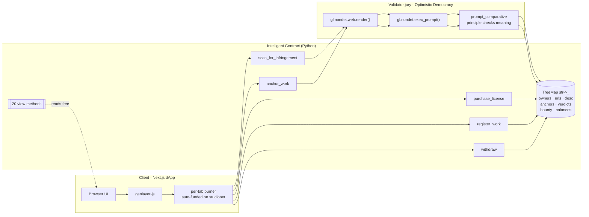

# Architecture

LicenseLogic is a single Intelligent Contract (Python) deployed on GenLayer
studionet, backed by a Next.js dApp. This document describes the runtime
layers, the on-chain data model, and the two consensus paths (deterministic
shortcut + validator LLM jury).

## System diagram

## Layers

1. **Client** — Next.js 16 (App Router, Turbopack) on Vercel. `genlayer-js`
   SDK creates a per-tab burner account that studionet auto-funds via the
   provider. No wallet install needed. Writes are signed by the burner;
   reads bypass gas.
2. **Contract** — Python on GenVM. TreeMap-only storage, `bigint` and
   sized-int money math, `checked_add/sub` on every u256 mutation.
3. **Consensus** — every non-deterministic call
   (`gl.nondet.web.render`, `gl.nondet.exec_prompt`) is wrapped in
   `gl.eq_principle.prompt_comparative`. Each validator fetches and prompts
   independently; principle judges whether their outputs are equivalent.

## Two consensus paths for `scan_for_infringement`

### Path A — Deterministic self-scan shortcut
When the suspect URL canonicalizes to the same identity as the registered
work URL, the contract returns INFRINGEMENT deterministically (no LLM
call, no bounty payout on self-scans). This prevents self-farming and gives
reviewers a predictable INFRINGEMENT sample.

### Path B — Validator LLM jury (real path)
1. `gl.nondet.web.render(suspect_url, mode="html")` fetches the page live.
2. HTML is stripped to text and truncated to 8000 chars.
3. A canary token is embedded to detect prompt injection.
4. `gl.nondet.exec_prompt(prompt, response_format="json")` on each validator.
5. `prompt_comparative` runs a validator LLM over both leader and this
   validator's outputs, judging by the `CONSENSUS_PRINCIPLE`:
   - verdict bucket must match (INFRINGEMENT / CLEAR / UNCERTAIN)
   - similarity must sit inside its bucket (≥70 / <40 / otherwise) and be
     within a bounded drift of the leader
   - `fetch_failed` and `injection_attempt` booleans must agree; a `true`
     on either side forces UNCERTAIN
6. Verdict + reasoning + similarity are stored on-chain under a canonical
   URL hash so alias variants collapse to one evidence slot.

## Anchoring (`anchor_work`)

Owner-only. Fetches the reference URL, extracts text, and runs
`gl.nondet.exec_prompt` for a 2–3 sentence factual summary. The resulting
summary is stored as the anchored snapshot — later scans compare against
that snapshot, not just the owner's free-text description.

## Storage model

All TreeMaps are keyed by `str` for calldata compatibility (R19 in
`~GEN_RULES/02-common-errors.md`). Addresses are stored as `str(addr)`.

| Field                       | Type                       | Purpose |
|-----------------------------|----------------------------|---------|
| `owners`                    | `TreeMap[str, Address]`    | work_id → owner |
| `work_url` / `work_desc`    | `TreeMap[str, str]`        | registered work |
| `license_price` / `penalty` | `TreeMap[str, u256]`       | economic params |
| `licensees`                 | `TreeMap[str, Address]`    | `{work_id}:{addr}` → holder |
| `infringement_count`        | `TreeMap[str, u256]`       | per-work counter |
| `last_verdict`              | `TreeMap[str, str]`        | per canonical URL |
| `withdrawable_balance`      | `TreeMap[str, u256]`       | pull-payment pattern |
| `infringement_bounty`       | `TreeMap[str, u256]`       | funded by owner |
| `work_content_anchor`       | `TreeMap[str, str]`        | LLM-consensus snapshot |
| `scan_credited`             | `TreeMap[str, bool]`       | first-honest bounty gate |
| `admin`                     | `Address`                  | pause/unpause authority |
| `work_counter`              | `u256`                     | next work_id |
| `total_received`            | `u256`                     | economic invariant |
| `epoch` (v8)                | `u256`                     | monotonic tick per write; drives license expiry |
| `license_tiers_count` (v8)  | `TreeMap[str, u256]`       | per-work tier count |
| `tier_name/price/duration_epochs/active` (v8) | `TreeMap[str, ...]` keyed `f"{work_id}:{idx}"` | tier record |
| `license_tier_idx/expires_at/purchased_at` (v8) | `TreeMap[str, u256]` keyed `f"{work_id}:{addr}"` | per-license metadata |
| `coauthors_count/coauthor_addr/coauthor_bps` (v8) | `TreeMap[str, ...]` | up-to-4 coauthor royalty splits (bps sum = 10000) |
| `bounty_contributor_count/addr/amount/index_by_addr` (v9) | `TreeMap[str, ...]` | permissionless bounty contributor registry (up to 50 per work; repeat contributions aggregate) |
| `watchlist_count/url/canonical/active/index_by_canonical` (v9) | `TreeMap[str, ...]` | owner-curated suspect URLs (up to 20 per work); scanners get 2× bounty share on active-watchlist hits |
| `takedown_notice/issued_at/verdict_epoch` (v9) | `TreeMap[str, ...]` | on-chain takedown registry keyed by `verdict_key` |

## Invariants
- Every write path that mutates u256 uses `checked_add` / `checked_sub`.
- `withdraw()` uses the pull-payment pattern — never `send_value`.
- No storage reads inside a non-deterministic block (state is captured
  before the block via closure).
- Every `TreeMap` key is `str`; addresses converted defensively.
- Every custom storage struct would be `@allow_storage @dataclass`
  (currently zero — flat storage keeps schema loading robust).

## Trust boundaries
- **Client → Contract**: the burner signs — no secret leaves the tab.
- **Contract → Web**: `gl.nondet.web.render` runs at consensus time; a
  failure is a first-class flag, not a silent success.
- **Contract → LLM**: `gl.nondet.exec_prompt` runs on each validator;
  divergence is settled by the `prompt_comparative` principle.
- **Suspect content → LLM**: boxed inside `<<<UNTRUSTED_...>>>` markers
  with a per-scan canary token; embedded instructions cannot re-steer
  the verdict.
