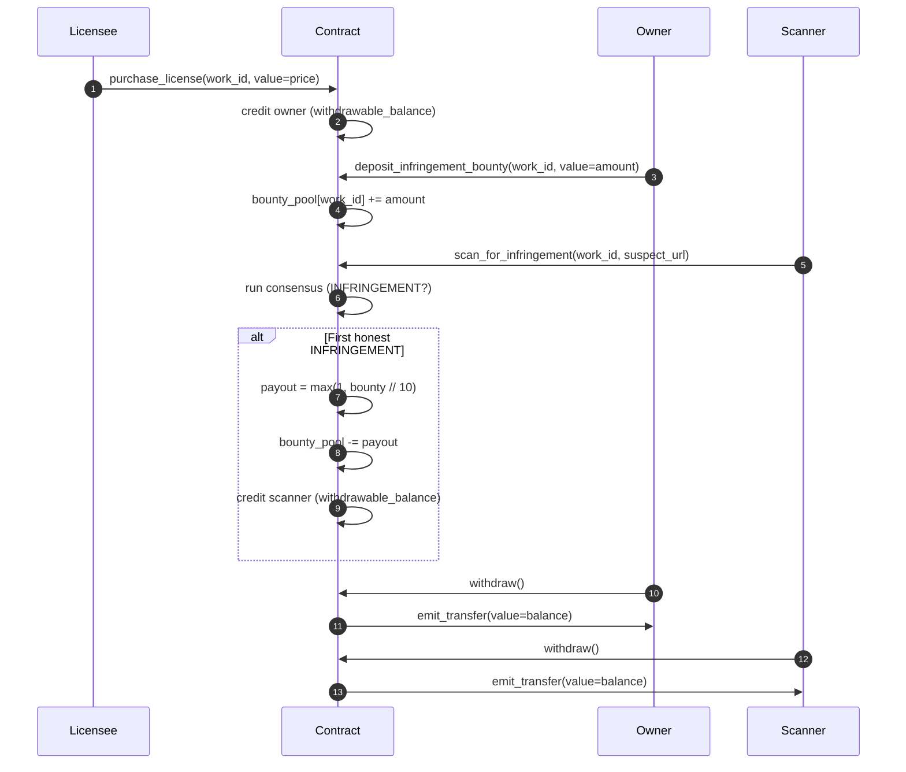

# Economics

LicenseLogic runs three token flows on studionet GEN. All amounts are `u256`
wei; the frontend renders raw wei so reviewers can double-check math on
Explorer.

## Actors

| Actor         | Role                                                         |
|---------------|--------------------------------------------------------------|
| **Owner**    | Registers a work, anchors it, funds bounty, withdraws income. |
| **Licensee** | Pays `license_price` to unlock use of the work.               |
| **Scanner**  | Submits suspect URLs; earns bounty on the first honest INFRINGEMENT for a canonical URL. |
| **Admin**    | Deployer. Can `pause()` / `unpause()` writes in emergencies (post v6). |

## Token flows

## Formulas

| Event                                     | Effect                              |
|-------------------------------------------|-------------------------------------|
| `purchase_license` first time             | owner balance += `msg.value`        |
| `purchase_license` re-buy (already licensed) | buyer balance += `msg.value` (refunded, no double-license) |
| `deposit_infringement_bounty`             | `bounty_pool[work_id] += msg.value` |
| First honest INFRINGEMENT (Path B)        | `payout = max(1, bounty_pool // 10)`; scanner balance += payout; pool -= payout |
| Repeat INFRINGEMENT on same canonical URL | no payout (`already_credited=true`) |
| INFRINGEMENT via URL shortcut (Path A)    | no payout (`registered_url_shortcut=true`) |
| `withdraw()`                              | drains sender's `withdrawable_balance` |
| Stray transfer to contract                | credited to sender via `__receive__` |

## Invariants

- `sum(withdrawable_balance) + sum(infringement_bounty) ≤ total_received`
- Bounty pool never goes negative (`checked_sub` on payout).
- License price is fixed at registration — cannot be raised retroactively.
- Owner cannot license their own work (`buyer == owner` reverts).
- Pull-payment only. The contract never pushes GEN to an EOA outside of
  `withdraw()`.

## Anti-abuse rules

1. **Canonical URL identity** — http↔https, case, `www.`, default ports,
   trailing slash, fragment, and tracking params (`utm_*`, `fbclid`,
   `gclid`, `msclkid`, `yclid`, `_ga`, `mc_cid`, …) are stripped before
   the evidence key is derived. Aliases collapse to one payout slot.
2. **First-honest gate** — `scan_credited[work_id:hash]` flips true on the
   first counted INFRINGEMENT. Replays return the same verdict, no payout.
3. **Self-scan shortcut** — INFRINGEMENT via URL shortcut is deterministic
   and does not pay bounty. Owners cannot farm their own bounty.
4. **Consensus flags** — `fetch_failed=true` or `injection_attempt=true`
   force UNCERTAIN. Neither counts as INFRINGEMENT; neither pays.
5. **Bounded payout** — 10 % of the pool per honest hit, min 1 wei, max
   whole pool. Prevents a single mass-scan from draining the pool in one
   payout while still rewarding real reports.

## Gas / consensus cost expectations

| Method                        | Cost profile                        |
|-------------------------------|-------------------------------------|
| `register_work`               | Deterministic write. Cheap.         |
| `anchor_work`                 | Non-deterministic: 1 fetch + 1 LLM. Slow (~30–90 s). |
| `scan_for_infringement` (Path A) | Deterministic. Cheap.             |
| `scan_for_infringement` (Path B) | Non-deterministic: 1 fetch + 1 LLM. Slow. |
| `purchase_license`            | Deterministic write. Cheap.         |
| `deposit_infringement_bounty` | Deterministic write. Cheap.         |
| `withdraw`                    | Deterministic write + transfer.     |
| Any view                      | Read-only. Free.                    |
