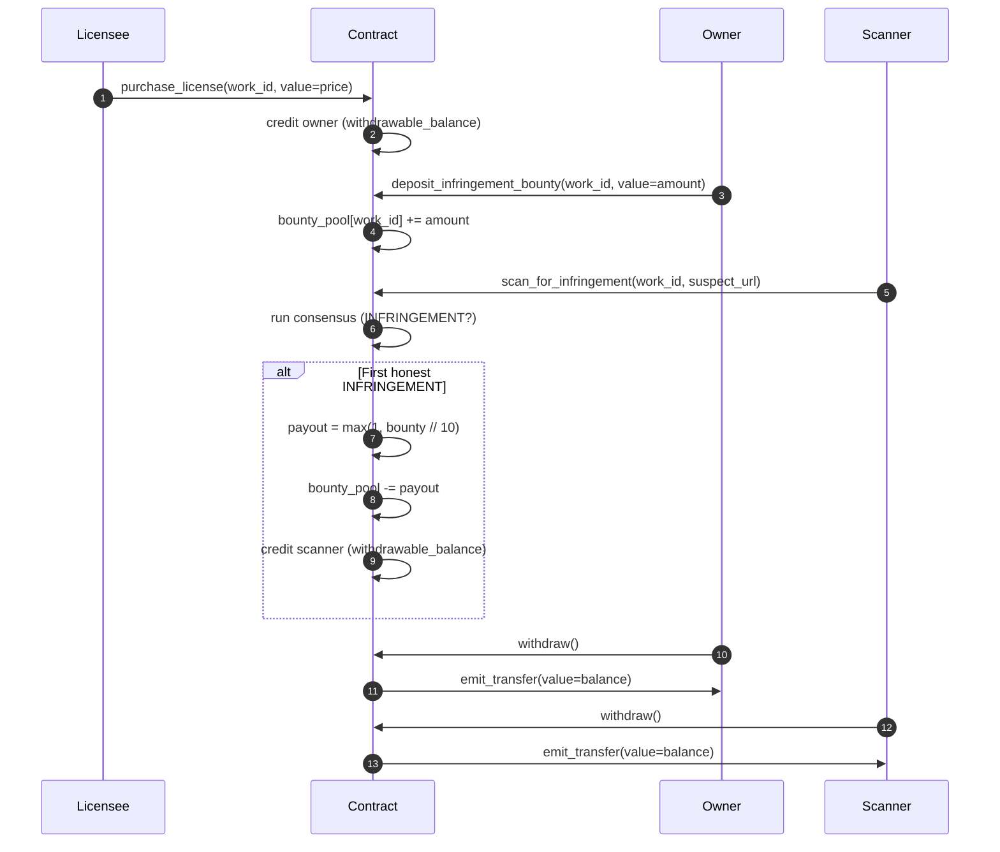

# Economics

LicenseLogic runs three token flows on studionet GEN. All amounts are `u256`
wei; the frontend renders raw wei so reviewers can double-check math on
Explorer.

## Actors

| Actor         | Role                                                         |
|---------------|--------------------------------------------------------------|
| **Owner**    | Registers a work, anchors it, funds bounty, withdraws income. |
| **Licensee** | Pays `license_price` to unlock use of the work.               |
| **Scanner**  | Submits suspect URLs; earns bounty on the first honest INFRINGEMENT for a canonical URL. |
| **Admin**    | Deployer. Can `pause()` / `unpause()` writes in emergencies (post v6). |

## Token flows



## v7 additions — appeals and reputation-tiered payouts

### Appeal flow
- **Stake to file:** `2 × penalty_amount[work_id]` (`get_appeal_required_stake` view).
- **OVERTURN outcome:** appellant refunded via `withdrawable_balance`;
  `scan_credited[key] = False`; `infringement_count -= 1`; scanner
  `honest_scans -= 1` and `overturned_scans += 1`.
- **UPHELD outcome:** stake → owner via `withdrawable_balance`; scanner
  `honest_scans += 1`.
- The trigger caller (whoever runs `resolve_appeal`) pays gas but earns
  no reward — prevents gaming the trigger.

### Reputation-tiered bounty share
The old flat 10 % of pool per honest INFRINGEMENT now scales with tier:

| Tier   | Threshold                                     | Bounty share |
|--------|-----------------------------------------------|--------------|
| Bronze | default                                       | 10 %         |
| Silver | ≥ 3 honest, ≤ 1 overturned                    | 15 %         |
| Gold   | ≥ 10 honest, 0 overturned (or ≥ 20 with ≤ 1) | 20 %         |

Only real LLM-path INFRINGEMENT counts toward `honest_scans`. URL
shortcuts are deterministic and don't prove judgment.

## v8 additions — License Marketplace (multi-tier, expiry, royalty splits)

### Multi-tier license offers
Every registered work ships with a `tier_0` = `{name: "default", price: license_price, duration_epochs: 0, active: true}`
auto-created by `register_work`. Owners can add up to `MAX_TIERS_PER_WORK = 8`
extra tiers via `add_license_tier(work_id, name, price, duration_epochs)`
and deactivate any tier with `set_tier_active(work_id, idx, false)`.

- `purchase_license_tier(work_id, tier_idx)` — payable. Reverts if the tier
  is inactive or if `msg.value < tier_price`. On first purchase, creates
  `licensees[key]` and stamps `license_tier_idx`, `license_purchased_at`,
  `license_expires_at`. On repeat purchase, extends the expiry by the tier's
  `duration_epochs` (a perpetual tier — duration 0 — overrides any prior
  expiry back to perpetual).
- Legacy `purchase_license(work_id)` still works and routes through
  `tier_0`, preserving the idempotent refund semantics.

### Time-bound license expiry — the write epoch
`self.epoch: u256` is a monotonic counter that ticks once at the start of
every `@gl.public.write` method. Views never tick it. A license with
`duration_epochs = D` bought at epoch `E` expires when `epoch >= E + D`.
`has_license` returns false past that point; `get_license` returns
`{has_license: true, active: false, ...}` so the frontend can distinguish
"never bought" from "bought and expired".

Duration `0` means perpetual — the check short-circuits to true.

### Co-author royalty splits
`set_coauthors(work_id, [addr, ...], [bps, ...])` — owner-only. Up to
`MAX_COAUTHORS_PER_WORK = 4` coauthors; the bps list MUST sum to
`BPS_TOTAL = 10000`. When no coauthors are registered, `_split_credit`
falls back to primary owner 100 %.

Every credit that would previously go to the owner (license revenue AND
UPHELD appeal-stake payouts) now flows through `_split_credit(work_id,
amount)`:

- All coauthors except the last receive `amount * bps // 10000`.
- The last coauthor receives the remainder, so `sum(credits) == amount`
  exactly. No wei is lost or minted.

Bounty payouts on scans still go 100 % to the scanner — the split applies
to owner-side revenue only.

## v9 additions — Watchtower (community bounty · watchlist · takedown)

### Permissionless bounty funding
`fund_bounty(work_id)` payable — anyone (owner included) tops up the pool.
Contributor identity + running total per address are stored via
`bounty_contributor_addr` / `bounty_contributor_amount` (indexed by
`bounty_contributor_index_by_addr` so repeat contributions aggregate into
one slot). Cap: `MAX_BOUNTY_CONTRIBUTORS = 50` distinct funders per work.

Legacy `deposit_infringement_bounty` (owner-only) still works and both
methods share the same underlying `infringement_bounty[work_id]` pool.

### Watchlist bounty multiplier
`add_watchlist_url(work_id, url)` — owner-only, up to
`MAX_WATCHLIST_PER_WORK = 20` entries. `set_watchlist_active` soft-toggles
without renumbering. When `scan_for_infringement` lands INFRINGEMENT on a
URL whose canonicalized form matches an ACTIVE watchlist entry, the
scanner's bounty share is multiplied by `WATCHLIST_BOOST_NUM / WATCHLIST_BOOST_DEN
= 2 / 1` (2×), still capped at the remaining pool. The shortcut path
(registered-URL match) never pays bounty at all — watchlist boost only
applies to the real-LLM path.

### On-chain takedown notice
`issue_takedown_notice(work_id, url)` — anyone can call. Guards:
- verdict must exist AND be INFRINGEMENT AND NOT `fetch_failed`
- appeal state must NOT be `pending` or `overturned`
- current epoch must be ≥ `verdict_epoch + TAKEDOWN_APPEAL_GRACE_EPOCHS = 25`
  (historic pre-v9 verdicts with `verdict_epoch == 0` are accepted)
- re-issue is idempotent — the same notice is returned byte-for-byte

The notice bundle stores every evidence field a downstream lawyer /
platform needs: `work_id`, owner, work_url, anchor_summary,
suspect_url, canonical_url, verdict_key, verdict, similarity,
matched_elements, perspectives, on_watchlist, verdict_epoch,
issued_at_epoch, appeal_state, appeal_uphold, issuer. Public view
`get_takedown_notice(work_id, url)` returns it. `takedown_ready(work_id, url)`
is a dry-run that tells the frontend WHY a takedown is not yet callable
(`grace_window`, `appeal_pending`, `appeal_overturned`, etc.).

## v10 additions — Secondary Market (transferable licenses + resale + royalty)

### Transferable licenses
Per tier a boolean `tier_transferable[work_id:idx]` — default false; owner
opts in via `set_tier_transferable(work_id, idx, true)`. Only tiers with
the flag true can be transferred or listed for resale.

- `transfer_license(work_id, to)` — free hand-off; moves license record
  (tier_idx, expires_at, purchased_at) from sender to recipient, bumps
  `license_transferred_count[to]`, auto-clears any resale listing the
  sender had. Reverts on non-transferable tier, `to == owner`,
  `to == sender`, or if `to` already holds an active license.

### On-chain resale market
- `list_for_resale(work_id, ask_price)` — seller must hold a license on
  a transferable tier. Overwrites prior listing from the same seller.
  Also records the seller in the append-only per-work resale directory.
- `cancel_resale(work_id)` — take your listing down.
- `buy_from_resale(work_id, seller)` payable — buyer must NOT already
  hold an active license on `work_id`, cannot be the owner, cannot be
  the seller. Reverts if `msg.value < ask_price`. Splits payment:

```
royalty = ask * resale_royalty_bps // 10000    → _split_credit(work_id) (co-authors)
proceeds = ask - royalty                       → seller
overpay = msg.value - ask                      → refunded to buyer
```

License state is moved atomically by `_move_license_state`.

### Perpetual creator royalty
`resale_royalty_bps[work_id]` — set via `set_resale_royalty_bps`, capped
at `MAX_RESALE_ROYALTY_BPS = 2000` (20%). Default when unset is
`DEFAULT_RESALE_ROYALTY_BPS = 500` (5%); passing 0 explicitly opts out
of the default (`resale_royalty_set` distinguishes these cases).

Because royalty flows through `_split_credit`, every resale continues to
pay whatever co-author basis points were configured for the work. A
30-hop resale chain still pays every original co-author their share
without any off-chain enforcement.

## Formulas

| Event                                     | Effect                              |
|-------------------------------------------|-------------------------------------|
| `purchase_license` first time             | tier_0 routed via `_split_credit` → coauthors (or owner if none) `+= msg.value` |
| `purchase_license` re-buy (already licensed) | buyer balance += `msg.value` (refunded, no double-license) |
| `purchase_license_tier` (new tier)        | `_split_credit(work_id, msg.value)`; expires_at = `epoch + duration` (0 = perpetual) |
| `purchase_license_tier` (renew)           | `_split_credit(work_id, msg.value)`; expires_at extended by `duration` |
| `deposit_infringement_bounty` (owner)     | `bounty_pool[work_id] += msg.value` |
| `fund_bounty` (v9, anyone)                | `bounty_pool[work_id] += msg.value`; contributor entry created/aggregated |
| First honest INFRINGEMENT (Path B, off-watchlist) | `payout = max(1, bounty_pool * tier_pct // 100)` capped at pool; scanner balance += payout |
| First honest INFRINGEMENT on watchlisted URL (v9) | payout above × 2, still capped by remaining pool |
| `transfer_license` (v10)                  | license record moved seller→buyer (no wei moved); prior seller listing auto-cancelled |
| `list_for_resale` (v10)                   | (no wei moved) — records ask price + marks listing active |
| `buy_from_resale` (v10)                   | royalty = `ask * bps // 10000` → `_split_credit(work_id)`; proceeds = `ask - royalty` → seller; overpay refunded to buyer |
| Repeat INFRINGEMENT on same canonical URL | no payout (`already_credited=true`) |
| INFRINGEMENT via URL shortcut (Path A)    | no payout (`registered_url_shortcut=true`) |
| `withdraw()`                              | drains sender's `withdrawable_balance` |
| Stray transfer to contract                | credited to sender via `__receive__` |

## Invariants

- `sum(withdrawable_balance) + sum(infringement_bounty) ≤ total_received`
- Bounty pool never goes negative (`checked_sub` on payout).
- License price is fixed at registration — cannot be raised retroactively.
- Owner cannot license their own work (`buyer == owner` reverts).
- Pull-payment only. The contract never pushes GEN to an EOA outside of
  `withdraw()`.

## Anti-abuse rules

1. **Canonical URL identity** — http↔https, case, `www.`, default ports,
   trailing slash, fragment, and tracking params (`utm_*`, `fbclid`,
   `gclid`, `msclkid`, `yclid`, `_ga`, `mc_cid`, …) are stripped before
   the evidence key is derived. Aliases collapse to one payout slot.
2. **First-honest gate** — `scan_credited[work_id:hash]` flips true on the
   first counted INFRINGEMENT. Replays return the same verdict, no payout.
3. **Self-scan shortcut** — INFRINGEMENT via URL shortcut is deterministic
   and does not pay bounty. Owners cannot farm their own bounty.
4. **Consensus flags** — `fetch_failed=true` or `injection_attempt=true`
   force UNCERTAIN. Neither counts as INFRINGEMENT; neither pays.
5. **Bounded payout** — 10 % of the pool per honest hit, min 1 wei, max
   whole pool. Prevents a single mass-scan from draining the pool in one
   payout while still rewarding real reports.

## Gas / consensus cost expectations

| Method                        | Cost profile                        |
|-------------------------------|-------------------------------------|
| `register_work`               | Deterministic write. Cheap.         |
| `anchor_work`                 | Non-deterministic: 1 fetch + 1 LLM. Slow (~30–90 s). |
| `scan_for_infringement` (Path A) | Deterministic. Cheap.             |
| `scan_for_infringement` (Path B) | Non-deterministic: 1 fetch + 1 LLM. Slow. |
| `purchase_license`            | Deterministic write. Cheap.         |
| `deposit_infringement_bounty` | Deterministic write. Cheap.         |
| `withdraw`                    | Deterministic write + transfer.     |
| Any view                      | Read-only. Free.                    |
